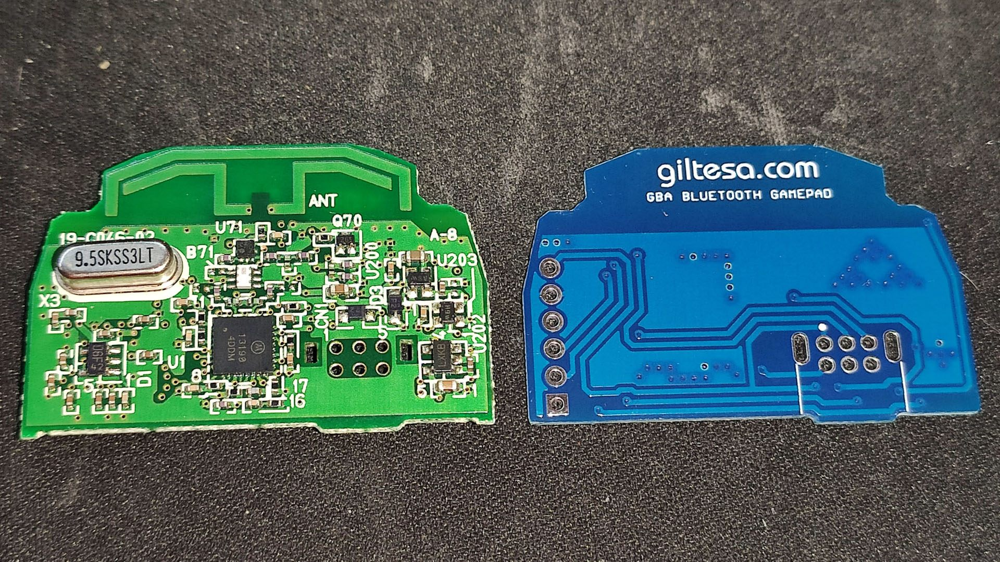
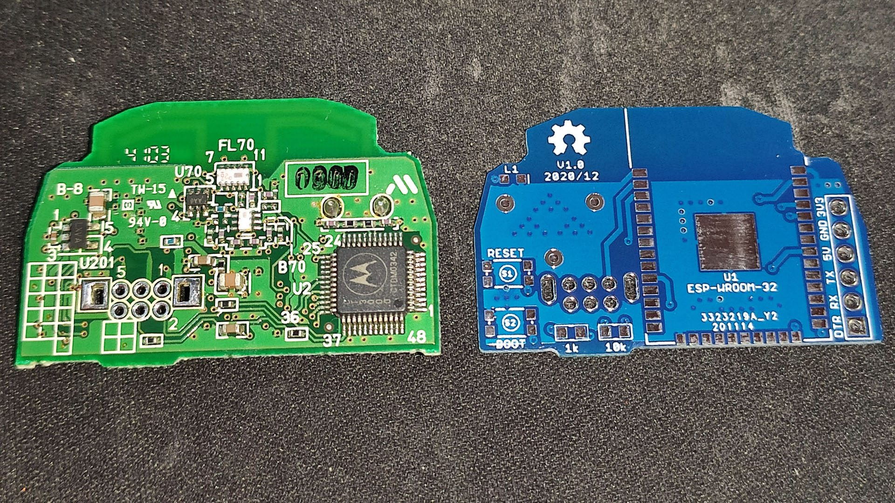
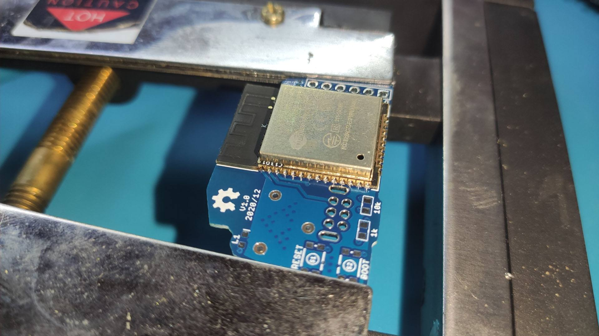
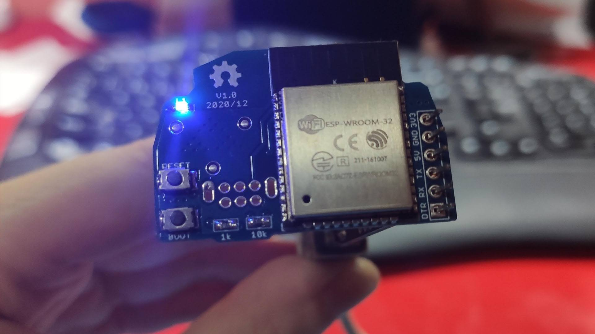
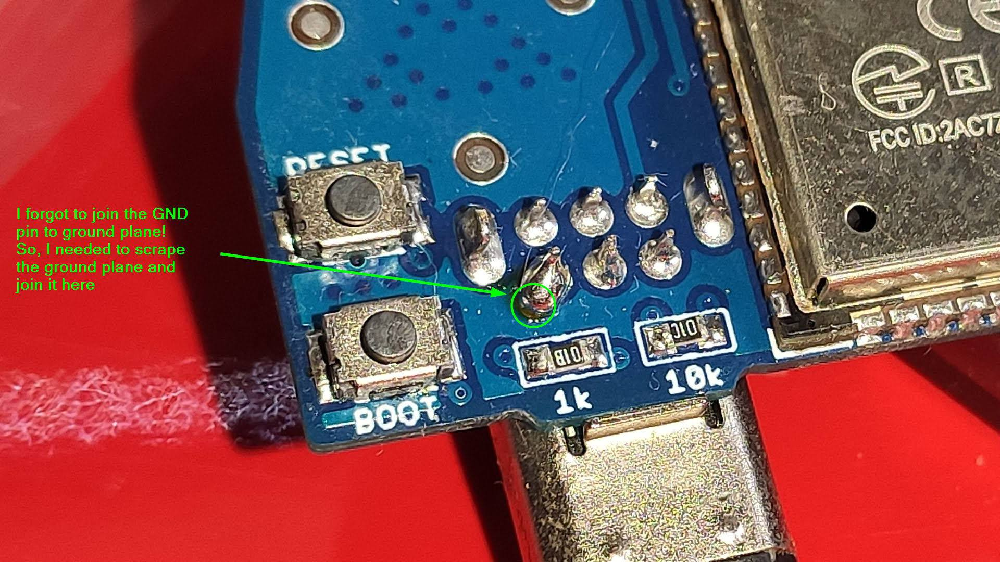
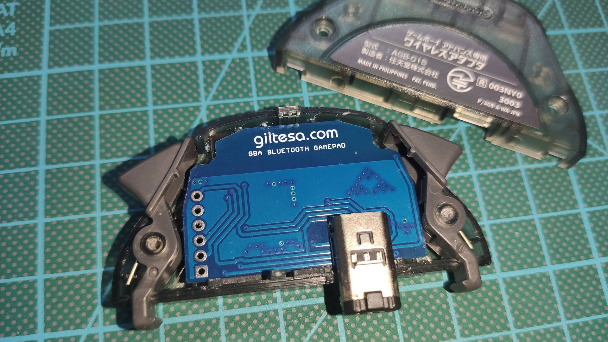
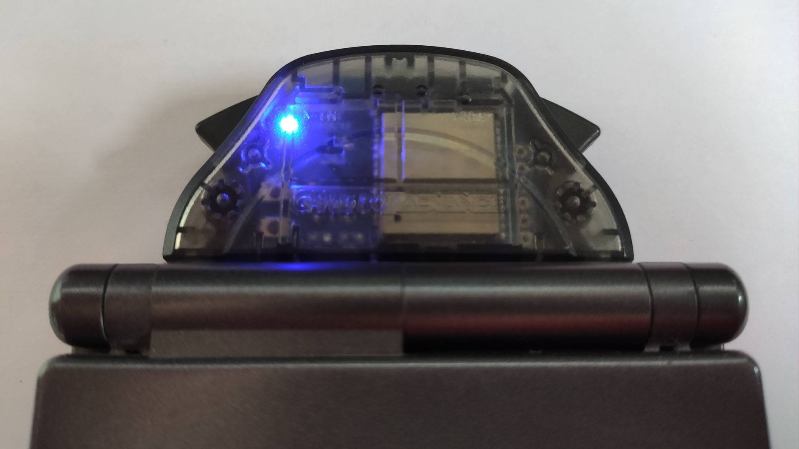
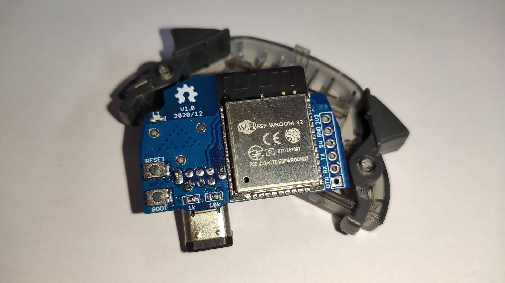

# PCB (Assembled Board)

This section shows the manufactured and fully assembled PCB of the GBA Wireless Gamepad.

These images document the final hardware build, including soldering and component placement.

## Gallery

